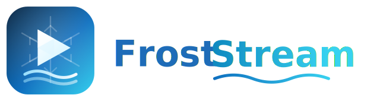

# FrostStream



**A self-hosted media archiving and streaming server.** 

Froststream is a self-hosted media archival tool and library. It downloads music and video files (via yt-dlp), and presents the media files in a youtube-like web interface.
This allows for a personal media collection that can't be removed by corporations.

The application is entirely designed to be accessed by REST, so clients can be made easily for interacting with FrostStream, the same way the web UI interacts.


---

#### AI Notice
This application has been vibe coded, though it has been guided to follow an architectural design/structure. Once more of the core features have been implemented,
the plan is to rework some of the logic to hand-edited code. (I would not be able to develop an application of this size myself if not for AI).
---


## Getting Started

### Prerequisites

- [.NET 10 SDK](https://dotnet.microsoft.com/) and the [Aspire CLI](https://learn.microsoft.com/dotnet/aspire/) (optional — `dotnet run` on the AppHost works too)
- Docker or Podman (infrastructure containers)
- Node.js 20+ and [pnpm](https://pnpm.io/) (frontend)

### Run for development (Aspire)

Everything — services, containers, config — is orchestrated by the AppHost:

```bash
cd src/App
dotnet run --project AppHost/AppHost.csproj   # or: aspire run
```

Then open:

- **Frontend** — http://localhost:25000
- **API (Scalar)** — http://localhost:25200/scalar/v1
- **Aspire dashboard** — printed in the console output (logs, traces, resource state)

Configuration lives in [`src/App/AppHost/aspire-development.env`](src/App/AppHost/aspire-development.env) — the single source of truth for mode flags, ports, secrets, and tunables. The defaults run out of the box in **multi-user mode** (Authentik login: `admin@localhost` / `froststream-dev-admin`). For the simplest setup, flip to single-user:

```env
SINGLE_USER_MODE="true"   # no Authentik/OpenFGA containers, no login
```

Media and app data default to `<repo>/data` (override with `FROSTSTREAM_STORAGE_ROOT`).

The frontend can also be run standalone against an already-running WebAPI. Vite proxies `/api`,
`/auth`, and `/stream`; override `WEBAPI_UPSTREAM` when WebAPI is not on `http://localhost:25200`:

```bash
cd src/App/Frontend
pnpm install
WEBAPI_UPSTREAM=http://localhost:25200 pnpm run dev   # binds http://localhost:25000
```

### Run with Docker Compose

A ready-to-run compose export lives in [`src/App/docker-compose-artifacts/`](src/App/docker-compose-artifacts/):

```bash
cd src/App/docker-compose-artifacts
# review .env — every deployment-specific value (secrets, public URLs) is here
docker compose up -d --build
```

Notes:

- The compose file **builds the service images from this repo** (`build.context` points at `src/`), and config files are mounted relative to the compose file — so deploy from a checkout of the repository.

- `.env` holds all secrets and deployment URLs (`FRONTEND_PUBLIC_ORIGIN`, `AUTHENTIK_PUBLIC_AUTHORITY`, …). Change these when serving on a LAN address or domain — no republish needed.

- The production frontend image is Caddy plus static assets. WebAPI owns OIDC, refresh, logout,
  CSRF, and opaque browser sessions; encrypted session tickets live in the DataBridge-provisioned
  NATS KV bucket and Data Protection keys live in the `froststream-data-protection-keys` volume.

- Core backups and PostgreSQL WAL are written beneath the host path in `FROSTSTREAM_BACKUP_ROOT`
  (`./backups` by default). Media remains in the named volume `froststream-data`.

- OpenBao now uses persistent integrated storage. A new Compose deployment must be initialized and
  unsealed before the remaining services can start; follow
  [`docs/Markdown/BACKUP_RESTORE.md`](docs/Markdown/BACKUP_RESTORE.md#first-compose-start-openbao).

- The artifacts are **generated** — never hand-edit the yaml. Regenerate after AppHost changes:
  
  ```bash
  cd src/App
  aspire publish --apphost AppHost/AppHost.csproj -o docker-compose-artifacts
  ```
  
  The export bakes in the mode flags (`SINGLE_USER_MODE`, `ENABLE_HTTPS`, …) at publish time; switching modes means republishing.
  
  
---  

## Features

### 📥 Downloading & Archiving

- **One-off downloads**: submit any yt-dlp-supported URL for video or audio-only download, with optional stored option presets
- **Creator sources**: subscribe to channels/playlists; a hybrid scheduler (global tick + per-source check interval) automatically picks up new uploads, with an on-demand "scan now"
- **Playlist handling**: playlist URLs are detected and split out into per-item download jobs
- **Download queue**: live queue/detail/history views with server-sent-event progress updates
- **Cookies & PO tokens**: per-site cookie storage (kept in OpenBao, per user scroped) and a built-in [bgutil POT provider](https://github.com/Brainicism/bgutil-ytdlp-pot-provider) broker so YouTube downloads don't get blocked
- **Storage-affine workers**:  Use tags to assign jobs to workers with a specified tag
- __Multiple Storage Targets__ : Instead of being restricted to a single storage solution (local/FTP/S3), you can download media to the storage depending on your needs (per media). You can even download the same media to multiple storage solutions (for example, local vs a warm archive, like a NAS)
- __Multiple Media Editions__: If a media has multiple versions from the same url (like if a creator had updated a youtube video), it keeps *both* copies of the media

### 🗂️ Library & Metadata

- **Atomic ingestion**: All downloads are hashed (XxHash128), verified, and committed to the catalog with a trust model
- **Bulk import** (in progress): scan → probe → review → commit pipeline for migrating an existing media folder, with metadata enrichment. Plex/TubeArchivist support planned for a future release
- **Full-text search** — Typesense-backed search over media, comments, and captions (typo-tolerant), along with an advanced search. Local LLM/Embedding for search may be added for a future release, depending on demand.
- **Durable media assets** — thumbnails, captions, avatars, and banners are stored alongside media

### 📺 Playback

- **Browser playback**: Playback media via the web (desktop or mobile)
- **Server-side casting**: cast to remote devices. FCast and browser-based Chromecast should work for now, dedicated Chromecasting will come later
- **Playlists, notes, notifications, statistics** — the usual library comforts

### 🔐 Auth & Operations

- **Two auth modes**: single-user (no identity provider at all, for a single user) or multi-user via **Authentik** (OIDC) with **OpenFGA** fine-grained authorization
- **Secrets in OpenBao**:  storage credentials and cookies never sit in config files

---

## Architecture

```
                        ┌───────────────┐
   Browser ────────────▶│   Frontend    │  SvelteKit + Tailwind (BFF auth)
                        └──────┬────────┘
                               ▼
                        ┌───────────────┐     ┌────────────┐  ┌─────────┐
   Chromecast ◀────────▶│    WebAPI     │◀───▶│  Authentik │  │ OpenFGA │
                        └──────┬────────┘     └────────────┘  └─────────┘
                               │  NATS (request/reply + JetStream)
              ┌────────────────┼──────────────────┐
              ▼                ▼                  ▼
       ┌────────────┐   ┌────────────┐     ┌────────────┐
       │   Worker   │   │ DataBridge │     │ Scheduler  │
       │  (yt-dlp,  │   │ (EF Core,  │     │ (Quartz)   │
       │  storage)  │   │  sagas)    │     └────────────┘
       └────────────┘   └─────┬──────┘
                              ▼
                  PostgreSQL · Typesense · OpenBao
```

| Component          | Role                                                                                      |
| ------------------ | ----------------------------------------------------------------------------------------- |
| **AppHost**        | .NET Aspire orchestrator — starts every service and container, wires config/ports/secrets |
| **WebAPI**         | ASP.NET Core REST API (Scalar UI included) — all user-facing HTTP                         |
| **Worker**         | Executes yt-dlp, storage I/O, filesystem scans                                            |
| **DataBridge**     | Owns PostgreSQL Database (EF Core + FluentMigrator)                                       |
| **Scheduler**      | Quartz.NET recurring jobs (creator scans, scheduled backups) with a web UI                |
| **Frontend**       | SvelteKit app (BFF pattern — tokens never reach the browser)                              |
| **BackupTool**     | CLI for Postgres snapshot/full/WAL-archive backup and restore                             |
| **MediaProcessor** | Stub — reserved for future transcoding work                                               |

**Infrastructure containers:** NATS (JetStream), PostgreSQL, Typesense, OpenBao, bgutil pot-provider, and in multi-user mode Authentik + OpenFGA. Dev tooling: DbGate (DB browser), nats-ui, OpenFGA Studio.

### Port scheme

All host ports live in one registry ([`src/App/AppHost/Ports.cs`](src/App/AppHost/Ports.cs)) and follow a two-range convention — the same numbers apply in development and in the compose deployment:

| Range                | Meaning                                                                            | Ports                                                                                                                                                                                      |
| -------------------- | ---------------------------------------------------------------------------------- | ------------------------------------------------------------------------------------------------------------------------------------------------------------------------------------------ |
| **25xy0** (external) | Host-published; browser/host-facing                                                | frontend `25000` · authentik `25100` · webapi `25200` (https `25210`) · scheduler `25300` · openbao `25400` · postgres `25500` · dbgate `25600` · nats-ui `25700` · openfga-studio `25800` |
| **240xy** (internal) | Container-to-container only; bound on localhost in dev, never published by compose | typesense `24010` · pot-provider `24020` · openfga `24030` · nats `24040`–`24042`                                                                                                          |

External ports are overridable via `PORT_*` variables in the generated Aspire dev env.

---


### Tests

```bash
dotnet test --project Tests/UnitTests/UnitTests.csproj
dotnet test --project src/Modules/Conduit.NATS/Tests/Conduit.NATS.UnitTests/Conduit.NATS.UnitTests.csproj
```

---

## Repository Layout

```
├── src/
│   ├── App/
│   │   ├── AppHost/                  # Aspire orchestrator + all env/port/secret wiring
│   │   ├── WebAPI/                   # REST API
│   │   ├── Worker/                   # yt-dlp + storage execution
│   │   ├── DataBridge/               # persistence, sagas, migrations
│   │   ├── Scheduler/                # Quartz jobs
│   │   ├── Frontend/                 # SvelteKit app
│   │   ├── BackupTool/               # Postgres backup/restore CLI
│   │   ├── Shared/                   # shared contracts & options
│   │   └── docker-compose-artifacts/ # generated compose deployment
│   ├── Containers/                   # container resource definitions/config
│   └── Modules/                      # reusable libraries (Conduit.NATS, …)
├── Tests/                            # unit tests
├── docs/                             # design notes & feature inventory
└── data/                             # default dev storage root (gitignored)
```

---

## Status

FrostStream is under active development. The core download → ingest → library → playback loop, creator subscriptions, bulk import, search, casting, auth, and backups are implemented; transcoding (MediaProcessor) is not yet built. Expect rough edges.
