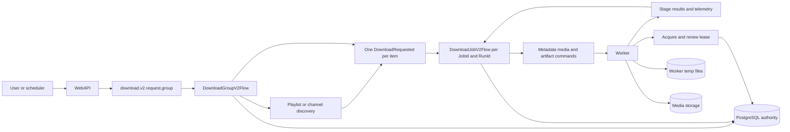
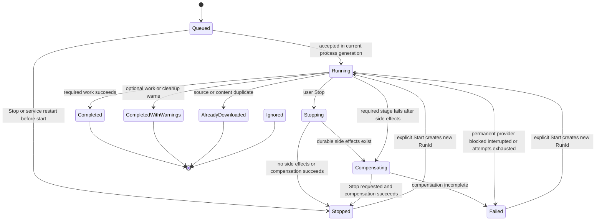
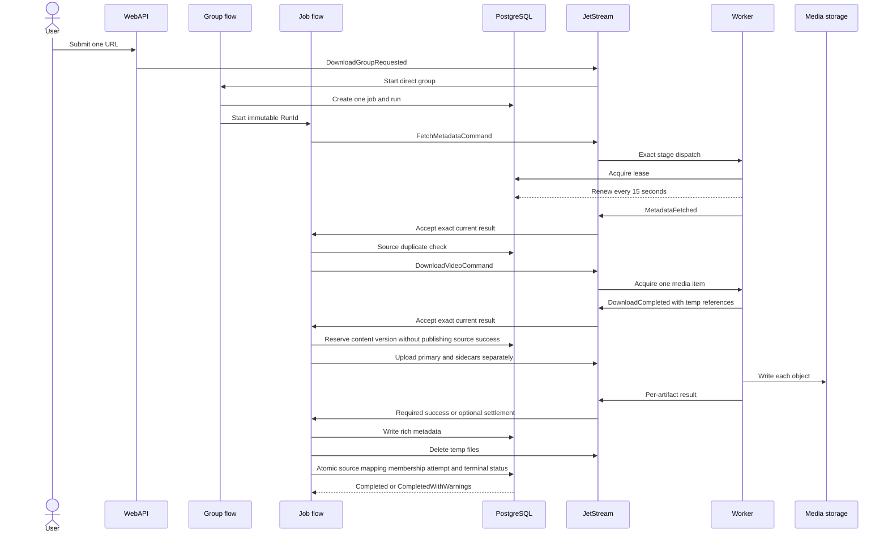
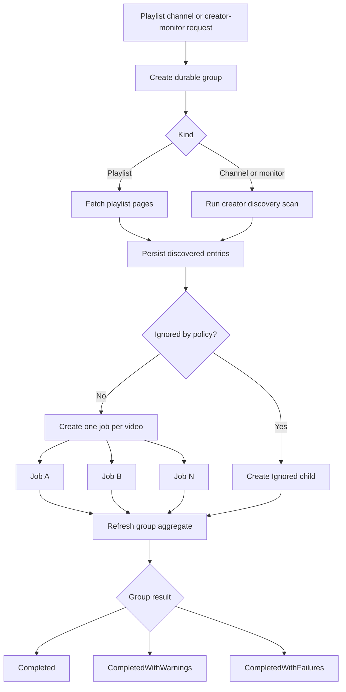
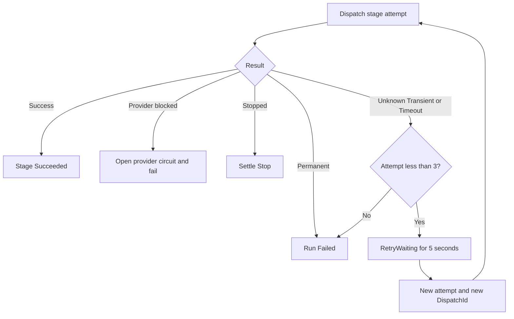
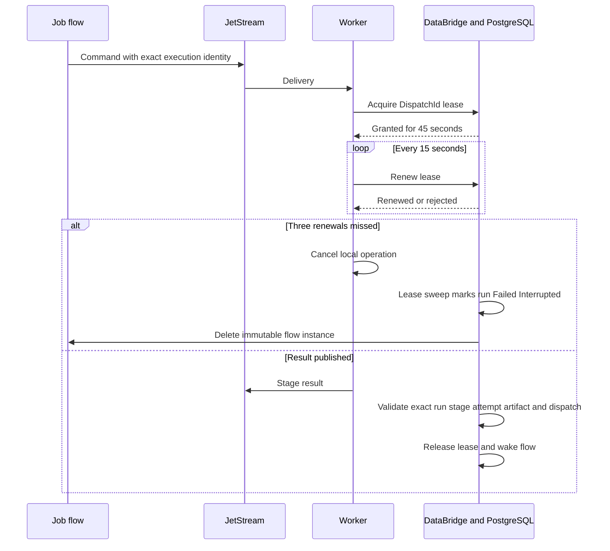
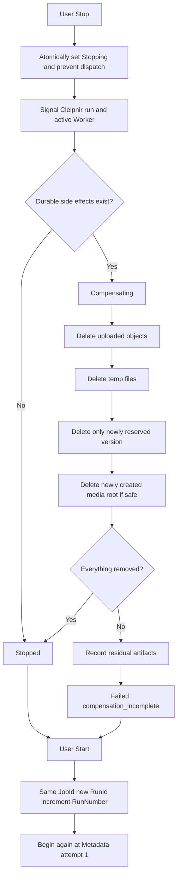
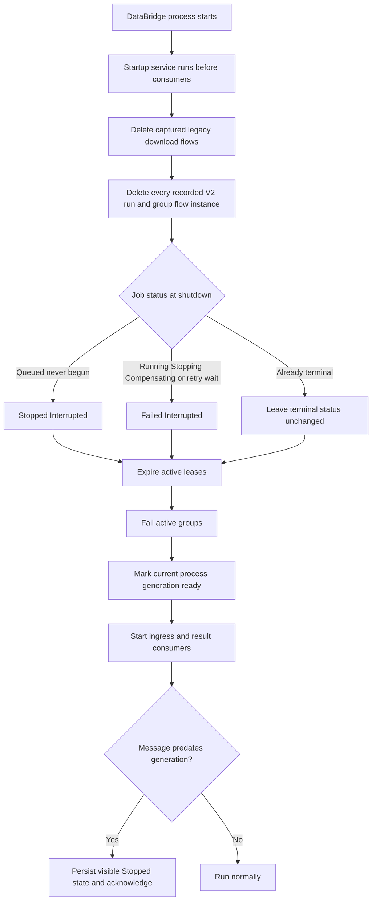
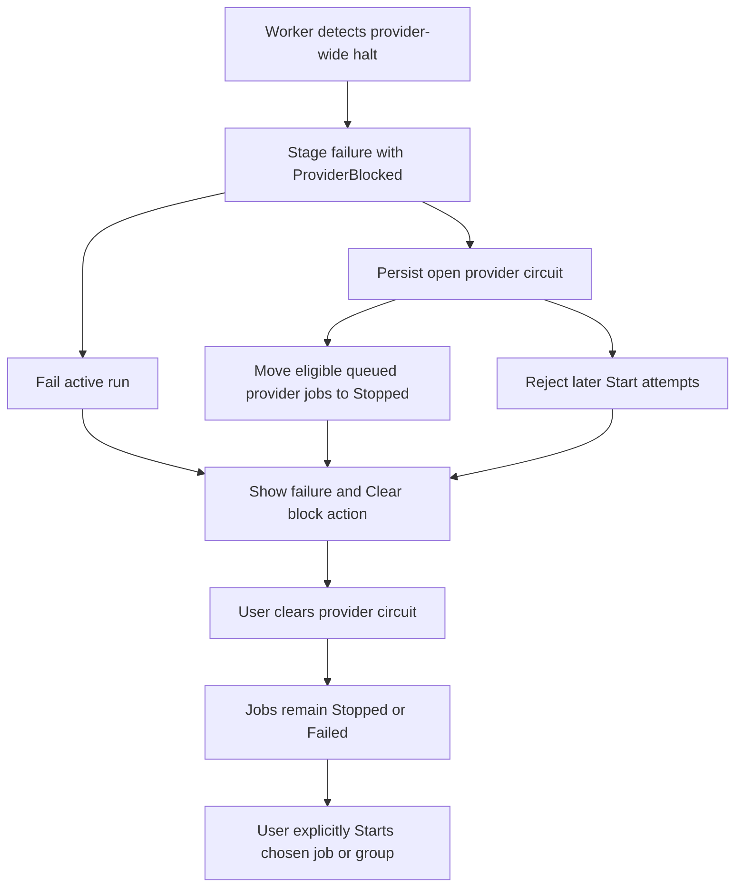

# FrostStream Download Flow V2

## Simple explanation

A direct video is one group containing one job. A playlist or channel is discovered first, then every video becomes its own independent job. The jobs share a `CorrelationId`, so the UI can control and summarize the collection without turning the collection into one fragile download. If video 7 fails, videos 1–6 and 8–15 continue normally.

Each job may have several runs. `JobId` stays stable, but every user-initiated Start creates a new `RunId` and begins again at metadata. A run moves through explicit stages, and each retryable stage gets at most three attempts with a fixed five-second delay. `Transient` is a failure classification during those attempts; it is not a job status. Attempt three failing ends the run as `Failed`.

Nothing resumes automatically after DataBridge restarts. Work that had not begun becomes `Stopped`; work that had begun, including work in a retry delay, becomes `Failed` with `Interrupted`. The user chooses which jobs or groups to Start again.

## Core rules

- PostgreSQL is authoritative for whether a command is allowed to execute.
- A Cleipnir job-flow instance represents exactly one immutable `(JobId, RunId)`.
- One discovered media item always maps to one job; a Worker never downloads a playlist or channel as one job.
- Sibling jobs do not share failure fate.
- A stage has at most three application attempts, five seconds apart.
- JetStream redelivery never increments the application attempt.
- `Completed` is committed only after required media, required metadata, optional-artifact settlement, cleanup settlement, and finalization.
- Stop and final completion lock the same job row, so they cannot both win.
- A stale command or event from an old run is acknowledged and ignored.
- Service startup never republishes or automatically starts download work.

## Identities and durable records

| Name | Purpose |
| --- | --- |
| `GroupId` | Stable identity of a direct, playlist, channel, or creator-monitor group. |
| `CorrelationId` | Shared identity on all jobs belonging to the same group. |
| `JobId` | Stable identity of one media item across user restarts. |
| `RunId` | Immutable identity of one execution. A Start always creates a new one. |
| `RunNumber` | User-facing sequence number under a job. |
| `Stage` | Current unit of work, such as metadata, media acquire, or a sidecar upload. |
| `ArtifactKey` | Distinguishes repeated work in one stage, especially individual captions. |
| `Attempt` | Application attempt for one `(RunId, Stage, ArtifactKey)`, from 1 through 3. |
| `DispatchId` | Stable identity of one Worker dispatch. Transport redelivery reuses it. |
| `MessageId` | Identity of one message for delivery deduplication. |
| `OperationKey` | Identity of one logical Cleipnir effect or result. |
| `CausationId` | Message that caused the current message. |

The V2 migration adds durable group, run, stage-attempt, artifact, warning, Worker-lease, and provider-circuit records. Prior runs and their attempts remain available after a user starts a fresh run.

## Architecture

## Job and stage states

Job statuses are:

- `Queued`, `Running`, `Stopping`, `Stopped`, and `Compensating`
- `Completed` and `CompletedWithWarnings`
- `Failed`, `AlreadyDownloaded`, and `Ignored`

Stage statuses are:

- `Pending`, `Running`, and `RetryWaiting`
- `Succeeded`, `Skipped`, and `Warning`
- `Failed` and `Stopped`

The old `FailedTransient`, `FailedPermanent`, `Cancelled`, `Cancelling`, and `ProviderHalted` values are not V2 lifecycle statuses. V2 records the reason independently as `FailureKind`, `FailureCode`, and `FailureMessage`.

## Single-download flow

### Submission

1. WebAPI validates the request and resolves user-owned configuration such as storage, cookie profile, option preset, and priority.
2. WebAPI creates a direct `DownloadGroupRequested` under `download.v2.request.group`.
3. `DownloadGroupV2Flow` creates the one child job and one initial run.
4. The immutable Cleipnir job-flow instance is named from both `JobId` and `RunId`.
5. A request published before the current DataBridge generation is persisted as `Stopped`, acknowledged, and not run. For a direct group, its embedded child is also persisted so it appears on the Jobs page and can be explicitly started.

### Happy path

### Stage order and completion policy

| Stage | Work | Policy after attempt 3 |
| --- | --- | --- |
| `Metadata` | Resolve provider identity, source version, rich metadata, and requested sidecar references. | Required; `Failed`. |
| `DuplicateCheck` | Skip bytes when the exact source version already exists and force is false. | Local decision; no retry loop. |
| `WaitingForWorker` | Expose that the run is about to dispatch media acquisition. | No separate slot-recovery state. |
| `MediaAcquire` | Run yt-dlp for exactly one media item into Worker-local temp files. | Required; `Failed` before durable writes. |
| `PrimaryMediaUpload` | Upload the primary media object and verify its hash. | Required; compensate and `Failed`. |
| `InfoJsonUpload` | Upload the captured `.info.json`. Rich metadata (including comments) is derived from this object at `RichMetadataWrite`, so it is required. | Required; compensate and `Failed`. |
| `MetaSidecarUpload` | Generate and upload FrostStream's `.meta` sidecar. | Required; compensate and `Failed`. |
| `ThumbnailUpload` | Upload a thumbnail when captured. | Optional warning. |
| `CaptionUpload` | Upload each caption independently using its own artifact key. | Optional warning per caption. |
| `RichMetadataWrite` | Commit required media/account/comment/caption metadata and request search sync. | Required; compensate and `Failed`. |
| `Cleanup` | Delete each Worker temp file independently. | Warning; completion may continue. |
| `Finalize` | Atomically settle source mapping, the final attempt, playlist membership, job, and run. | Required; compensate and `Failed`. |
| `Compensation` | Remove partial objects and database reservations. | Residual warnings plus `Failed`. |

`CompletedWithWarnings` is selected at the final transaction when one or more optional-artifact or cleanup warnings exist.

Requested audio rendition encoding is an idempotent background follow-up after the download terminal transaction. It is not a required download artifact and cannot reopen or strand an otherwise completed run.

### Duplicate paths

There are two duplicate decisions:

- Source duplicate: after metadata, the same provider media ID and source version already exist. Unless force is set, no bytes are downloaded. Playlist membership and `AlreadyDownloaded` commit atomically.
- Content duplicate: force or changed source metadata caused a download, but its content hash is already stored. Temporary files are cleaned, then source mapping, membership, and `AlreadyDownloaded` commit atomically. The existing bytes and their metadata are not rewritten or deleted.

## Playlist and channel fan-out

Playlist expansion fetches pages, writes staging rows idempotently, applies ignore policy, and creates deterministic child `JobId` values. Each playlist slot also receives a job-tracking row. The V2 group flow is the only code path that drains playlist staging and publishes children.

Channel and creator-monitor scans persist discovered media first, then publish one deterministic child request for each selected candidate. Force/all-item scans may select known items; normal scans select according to discovery policy. Every child carries the request's `CorrelationId` and executes independently.

Group status distinguishes child failures from expansion failure:

- `Completed`: all terminal children succeeded, were already downloaded, or were ignored.
- `CompletedWithWarnings`: no failed child, but at least one child completed with warnings.
- `CompletedWithFailures`: at least one child failed; siblings are unaffected.
- `Failed`: discovery/expansion itself failed or the coordinating service restarted during expansion.
- `Stopping` and then `Stopped`: a group Stop is settling its nonterminal children.

## Retries and failure classification

An application attempt is persisted before publication. A retry gets a new `DispatchId`; a JetStream redelivery of the same command keeps the same `DispatchId`. The Worker can claim a dispatch only once, so transport redelivery cannot create a fourth application attempt or duplicate execution.

If DataBridge restarts during the five-second delay, startup reconciliation sees a begun run and marks it `Failed` with `Interrupted`. It never resumes the delay.

## Worker leases and Worker loss

The lease duration is 45 seconds, the heartbeat interval is 15 seconds, and DataBridge checks expirations every five seconds. An expired dispatch is never reassigned automatically. A late command or result is acknowledged and ignored. If an upload lease expires, its in-progress artifact is retained as an explicit residual because the system can no longer prove that no object reached storage.

On graceful Worker shutdown, active operations are cancelled and report `Interrupted` unless the cancellation came from a user Stop. If DataBridge cannot be reached, the Worker still cancels after losing its lease; DataBridge eventually fails the run from lease expiry or startup reconciliation.

## Stop, compensation, and Start

Stopping a not-yet-started job is immediate. Stopping active work changes the durable gate first, then signals both the flow and Worker. If a command was published but not yet claimed, DataBridge grants exactly one drain lease marked `StopRequested`; the Worker cancels it before touching the provider or storage and emits the matching stopped result so the flow cannot remain stranded. Cleanup and compensation commands remain allowed while the job is `Stopping`; ordinary new work is rejected.

Every compensation operation also uses up to three attempts. Object-delete failure records an explicit residual artifact. Incomplete compensation ends as `Failed`, even when the original trigger was Stop, because manual attention may be required.

The final transaction takes a row lock on the same job used by Stop. It commits the provider/source mapping, playlist membership, final attempt, job, and run together. If finalization wins, Stop observes a terminal job and is rejected. If Stop wins, finalization returns false and cannot publish a successful source mapping, insert playlist membership, or write `Completed`.

Start is allowed only from `Stopped` or `Failed`. It keeps the `JobId`, preserves prior run history, creates a fresh `RunId`, increments `RunNumber`, clears working references and current failure fields, and begins at metadata. Old-run messages cannot match the new current execution identity.

## DataBridge restart

Startup publishes no commands and schedules no restarts. It does not compensate an interrupted run because that would itself be an automatic resume. Partial objects are retained in artifact records for later inspection/orphan cleanup, and the user must explicitly Start a fresh run.

If only WebAPI restarts, DataBridge and Worker continue normally. If only Worker restarts, its active leases expire and the affected runs become `Failed`. If DataBridge restarts, all begun runs become `Failed` regardless of whether their Worker survived.

## Provider circuits

The circuit is persisted in PostgreSQL; there is no competing Worker-memory registry. Clearing the circuit never starts work. It only allows a later explicit Start.

## Messaging topology

Download coordination uses `download.v2.>` in `FROSTSTREAM_DOWNLOAD_V2`:

- requests: `download.v2.request.group` and the internal per-child `download.v2.request.job`
- commands: metadata fetch and media acquire, with optional Worker-tag suffixes
- results: metadata/media success and failure
- advisory telemetry: stage started, heartbeat, succeeded, failed, and stopped
- controls: job/group Start and Stop, priority, lease acquire/renew, Worker stop, and provider clear

Generic upload, uploaded-object delete, and temp-file delete use the separate artifact-storage topology. Local import uses that same generic topology and is not coupled to download subjects.

Playlist metadata discovery retains its narrow playlist command/event stream, but there is no legacy playlist request ingress or legacy staging-drain consumer. `DownloadGroupV2Flow` exclusively owns V2 playlist fan-out.

## UI behavior

The Jobs page exposes:

- status, stage, and stage status
- run number and `RunId`
- attempt `n / 3`
- current artifact key
- warning count and last failure details
- individual Start and Stop
- group Start and Stop for playlist/channel jobs
- provider-circuit clear, explicitly separate from Start
- SSE status/progress updates plus persisted event history

## V2 migration and reset

Migration 63 performs a one-time reset of orchestration state only. It captures legacy download flow IDs for control-panel deletion, nulls `media_source_versions.latest_job_id`, and clears legacy download jobs/history/progress/failures/processed messages plus playlist job-tracking and scan-staging rows.

It preserves media, stored versions, rich metadata, creator discoveries, playlists, durable playlist membership, configuration, schedules, storage configuration, and every local-import flow. The startup service then deletes only the captured legacy download Cleipnir instances; local-import instances are never touched.

## Operational invariants to test

- No collection URL reaches yt-dlp as one media job.
- A collection with 15 selected videos creates 15 independently controllable jobs sharing one `CorrelationId`.
- Attempt four is impossible for a stage/artifact pair.
- `Transient` never appears as a job lifecycle status.
- `Completed` requires primary media, `.meta`, rich metadata, optional settlement, cleanup settlement, and atomic finalization.
- Optional sidecar exhaustion produces a warning; required work failure compensates.
- A Stop cannot race finalization into both `Stopped` and `Completed` side effects.
- A new run rejects every event from the prior `RunId`.
- Startup and lease loss never enqueue or resume work.
- Clearing a provider circuit never starts a job.
